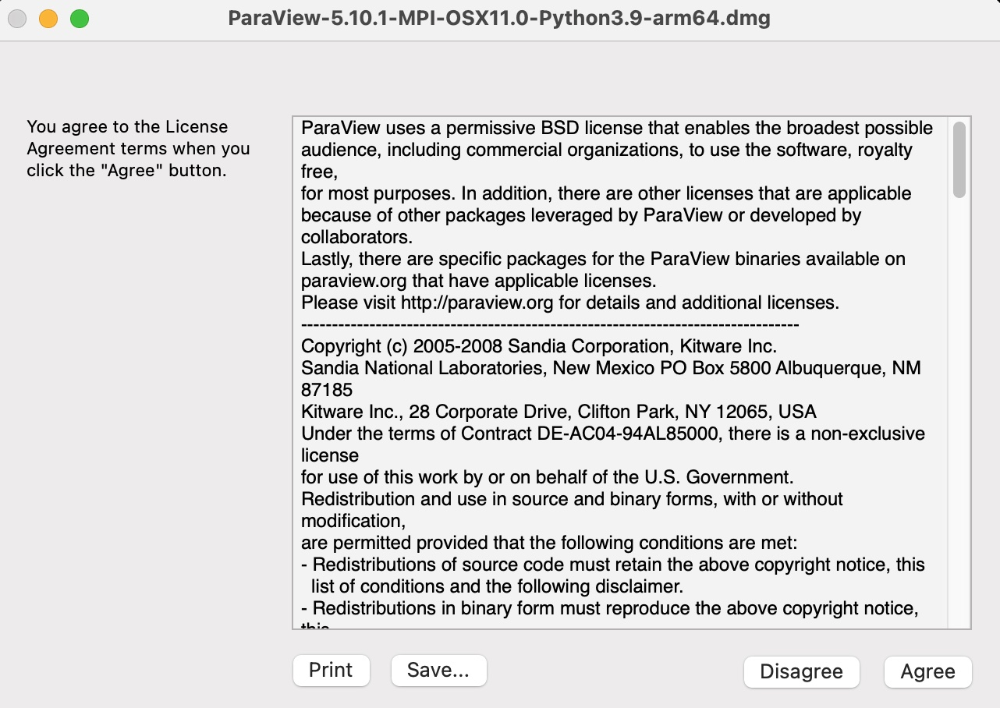
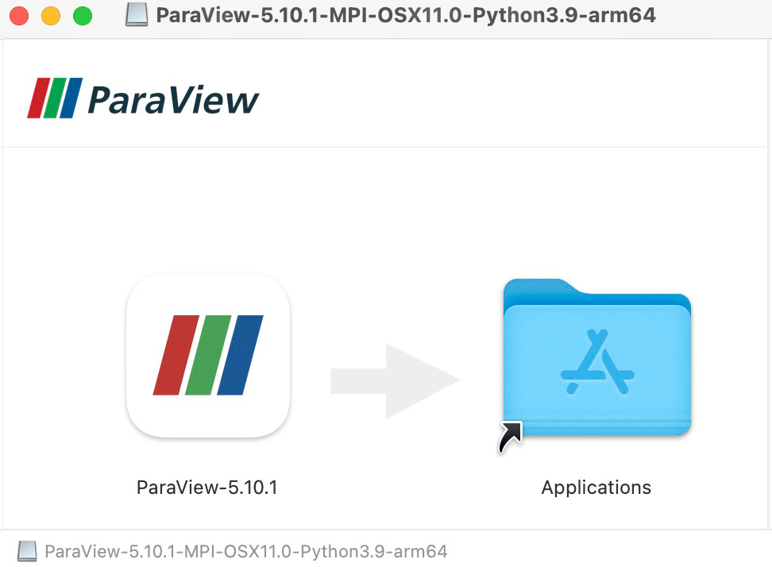

## Downloading Paraview

To download Paraview to your local machine, go to [www.paraview.org/download](https://www.paraview.org/download/). It should you a web page similar to that below.

The website should automatically select the correct operating system (OS) for
you, ie. Windows, MacOS or Linux. Each OS has a slightly different installation
procedure; we will focus upon MacOS below. 

In the example screenshot above, we would select either of the download links
highlighted:

* Ending in `x86_64.dmg` - for Intel based Macs
* Ending in `arm64.dmg` - for Apple Macs with M1 or M2 processors

Be sure you know what type of Mac you are using. 

## Installing Paraview

Once you have the correct `.dmg` file (MacOS) or `.msi` file (Windows),
click on it and follow the instructions. You should first see a end-user
agreement:

Click on 'Agree' then let the installation continue. On MacOS, you will be
prompted to drag Paraview into the Applications folder:

Drag the Paraview icon into the Applications folder. Paraview should now be
installed.


