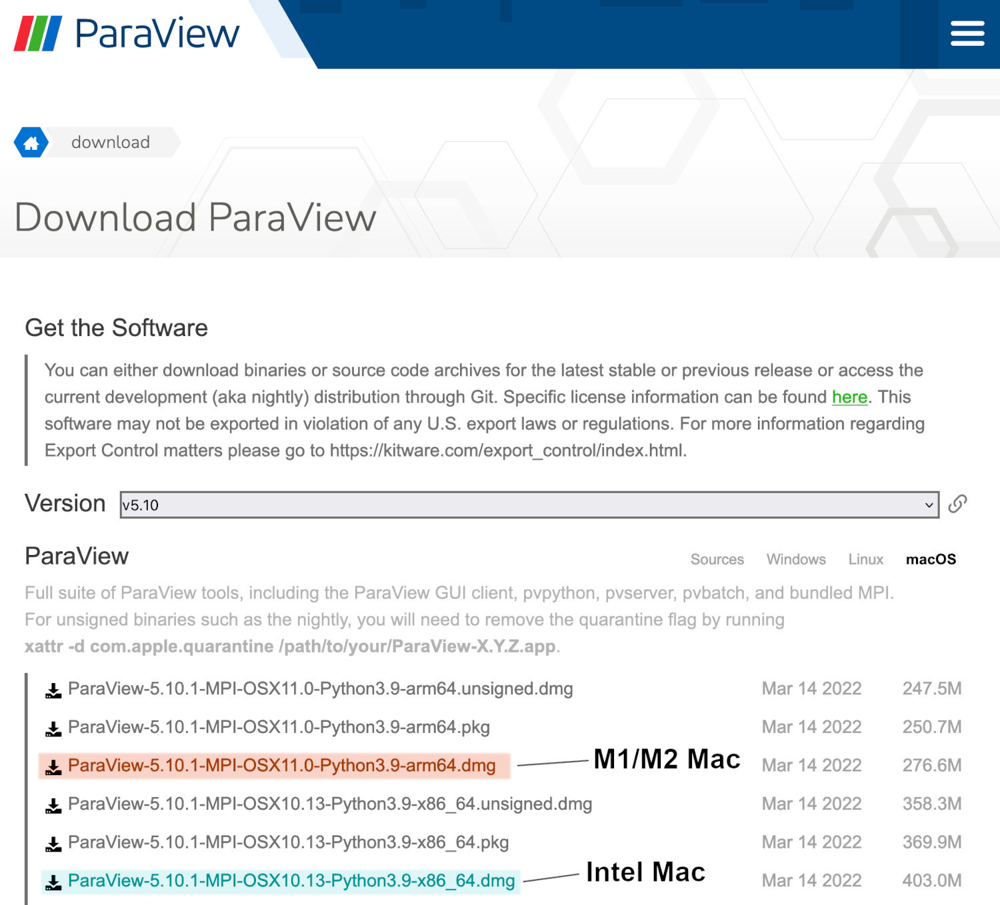

## Getting the Paraview examples

We have some example visualization files required for this lesson. You can
download the ZIP file from <a href="https://github.com/acenet-arc/paraview-introduction/releases/download/v0.1/acenet-paraview-examples.zip">here</a> (53 MB).

Once that is downloaded, you will need to extract them. Under MacOS, this can
be done simply by clicking on the ZIP file. Doing so will create a directory
called

`acenet-paraview-examples/`

This directory contains all the Paraview files you will need for this lesson.
The notes assume that you have extracted the ZIP file under **Desktop/**.

## Downloading Paraview

> ## Paraview v5.10
> We will be using **Paraview v5.10** for this tutorial. You can download other
> versions, but their behaviour may be different from what you see here.
> The download links here are for v5.10 only.
>
{: .callout}

To download Paraview to your local machine, go to <a href="https://www.paraview.org/download/?version=v5.10" target="_blank">www.paraview.org/download/?version=v5.10</a>. You should see a web page similar to this:

The website should automatically select the correct operating system (OS) for
you, ie. Windows, MacOS or Linux. Each OS has a slightly different installation
procedure.

In the example screenshot above, we would select either of the download links
highlighted:

* Ending in `x86_64.dmg` - for Intel based Macs
* Ending in `arm64.dmg` - for Apple Macs with M1 or M2 processors
* Ending in `AMD64.msi` - for Windows machines

Windows users can install any version with AMD64 in the title. For Apple Macs,
it is slightly more complicated - see below.

## Which MacOS version to download?

On MacOS, you will need to know which type of processor you have for Paraview.
If you click on the Apple menu on the top left, and then click on **About
This Mac**, you should see the following dialogue window:

Next to **Chip** you can see the type of CPU highlighted. This will either
be Intel, M1 or M2 (eg. ARM). Now you can download the appropriate version
of Paraview listed above.

## Installing Paraview

Once you have the correct `.dmg` file (MacOS) or `.msi` file (Windows),
click on it and follow the instructions. You should first see a end-user
agreement:

Click on **Agree** then let the installation continue. On MacOS, you may be
prompted to drag Paraview into the Applications folder:

Drag the Paraview icon into the Applications folder. Paraview should now be
installed.


